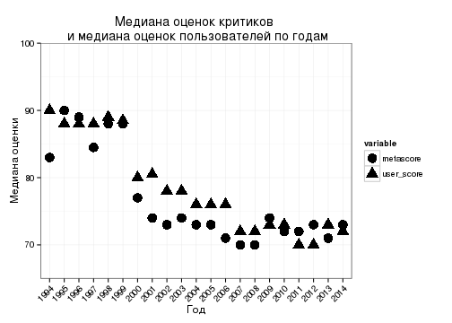
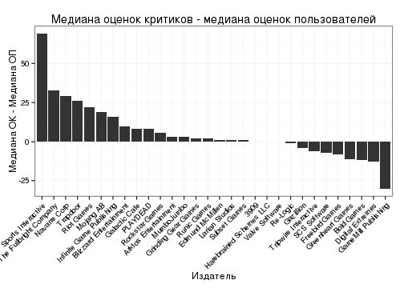

# Описательный анализ данных Metacritic

## Аннотация

В исследовании проведён сбор и описательный анализ данных сайта www.metacritic.com.
Проверяется гипотеза о том, что в большинстве случае оценки критиков и оценки пользователей значительно расходятся, 
и гипотеза о том, что год издания игры негативно ассоциирован с её оценкой.
Выявлена проблема репрезентативности данных Metacritic.

## Введение

Интернет-проект Metacritic (http://www.metacritic.com) является одним из сайтов, публикующих сводные рейтинги компьютерных и видеоигр. 
Выбор Metacritic в качестве объекта исследования обусловлен использованием его рейтингов в сервисах цифровой дистрибуции (Steam, Amazon и т.д.), 
в том числе в их рекомендательных движках, что может определять потребительский выбор. 
Кроме того, в случае, если данные Metacritic репрезентативны относительно популяции игроков и игровых критиков,
их можно рекомендовать к изучению в исследованиях мнений игроков и т.п.
Система агрегирования оценок на Metacritic предполагает выставление каждой игре двух оценок: оценки критиков (metascore),
рассчитывающейся как взвешенное среднее оценок, выставленных профессиональными рецензентами игровых медиа. 
Причём алгоритм распределения весов и метод вычленения численных оценок из текстов, в которых нет численной оценки, не описаны в публичном доступе. 
Вторая оценка &mdash; это оценка пользователей (user score), рассчитывающаяся как среднее арифметическое оценок, введённых зарегистрированными пользователями Metacritic. 
Целью данного исследования является описательный анализ и визуализация данных Metacritic из категории "Игры для ПК" (PC Games), 
выбранной для исследования ввиду наибольшей длительности жизненного цикла ПК как игровой платформы. 
Данные рассматриваются в разрезе по времени, по игровому жанру и др., сравниваются оценки пользователей и критиков, выявляются закономерности.
Предпосылкой исследования являются две гипотезы: первая &mdash; что в большинстве случае оценки критиков и оценки пользователей значительно расходятся, 
и вторая &mdash; что в среднем пользователи оценивают игры, выпущенные до 2000 года выше игр, выпущенных после этой даты.
Тире &mdash; тире.

## Методы исследования

Сбор данных с сайта www.metacritic.com был произведён 19 октября 2014 года с помощью фреймворка Scrapy.
Для каждой игры были извлечены: название, оценка пользователей, количество оценок пользователей, оценка критиков, количество оценок критиков, 
издатель, год издания, разработчик, платформа, жанр, тэги, возрастной рейтинг, ссылка.
Затем полученные данные обрабатывались средствами описательной статистики языка программирования R.
Исходный код для извлечения и анализа данааых доступны по адресу: is.gd/metacritic_code; набор данных в формате, поддерживаемом MS Excel, 
по адресу is.gd/metacritic_xls.

## Результаты

Общее число игр, представленных на Metacritic для платформы "Персональный компьютер", составляет 3031.
Как оценки пользователей (мода = 84), так и оценки критиков (мода = 77) 
не являются нормально распределёнными согласно критерию Шапиро-Уилка.
По годам игры распределены неравномерно: в 1994 представлена одна игра, в 2013 достигнут максимум &mdash; 303 игры.
Число оценок растёт от года к году: от 215 ОП и 5 ОК в 1994 
до 91369 ОП и 5112 ОК в 2013. 
В одномерной линейной модели год издания значимо связан с оценками пользователей (P < 0.0001), с коэф. B = -0.7634 
и R^2 = 5.5%.
Таким образом, чем раньше выпущена игра, тем выше её оценивают пользователи (см рис.1).
 
Наблюдается существенная разница между медианой оценок пользователей и медианой оценок критиков.
В разрезе по жанрам максимальная разница наблюдается для жанра Sports и составляет 7 баллов.
В разрезе по издателям также имеется расхождение между ОП и ОК; на рис. 1 представлена разница между медианами ОП и ОК для 30 издателей из верхней квартили 
по числу оценок пользователей (т.е. издателей, игры которых получили наибольшее внимание пользователей Metacritic).
 

5 игр, ОК и ОП которых больше всего расходятся: Out of the Park Baseball 2007, Navy SEALs: Weapons of Mass Destruction, Company of Heroes 2, Gods and Generals, Out of the Park Baseball 6.
В целом, пользователи оценили 48% игр выше, чем критики, 40% ниже, чем критики, и в 4% случаев оценки сравнялись 
(8% приходится на случаи, где отсутствует одна или обе оценки).

## Заключение

Полученные данные свидетельствуют о значительных расхождениях между оценками пользователей и оценками критиков в большинстве случаев.
Также подтверждается гипотеза об отрицательной корреляции между годом выпуска игры и её оценкой.
В целом, возникает сомнение в репрезентативности данных Metacritic. 
Источники данных, как в части профессиональных рецензий, так и в части пользовательских данных, не имют явного формализованного контроля.
Методика расчёта оценок далека от прозрачности, математической точности и универсальности, декларируемой разработчиками Metacritic. 
Актуальной задачей на будущее видится сбор большего количества данных, более глубокий анализ предвзятости критиков, связи их оценок с конкретными издателями, охват большего числа платформ, сравнение данных Metacritic с данными аналогичных порталов.

## Список литературы
